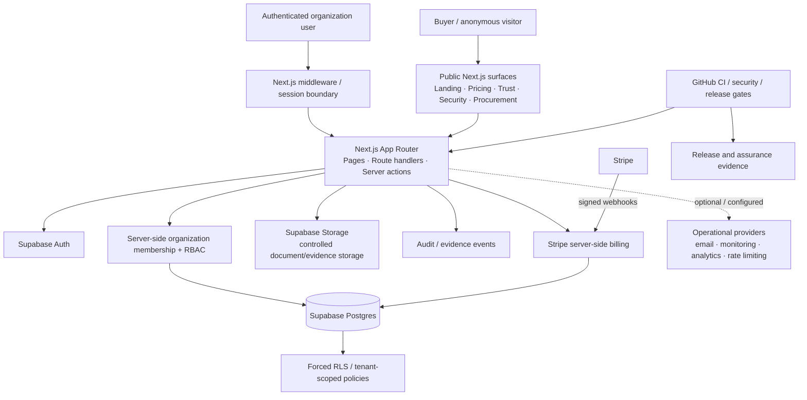

# RISCK COMPLY — Enterprise Architecture Diagram

Status: buyer-review architecture summary. This diagram describes repository-evidenced logical boundaries; it is not a network certification, provider attestation or guarantee that every optional provider is enabled for every customer.

## Trust boundaries

1. **Anonymous/public boundary** — only public marketing, pricing, Trust Center and buyer-safe procurement metadata are intended to be exposed.
2. **Authentication boundary** — private organization routes require a Supabase-authenticated session.
3. **Authorization boundary** — server-side organization membership and permission checks protect sensitive operations.
4. **Database tenant boundary** — organization-scoped Postgres access is backed by RLS policies; privileged service-role operations remain server-only.
5. **Storage boundary** — controlled uploads/evidence use server-side authorization and private-storage controls where configured.
6. **Billing boundary** — the browser does not authorize plan entitlements or raw payment state; server-side billing logic and signed Stripe webhook events provide provider authority.
7. **Provider boundary** — optional/conditional providers are disclosed in the subprocessor/provider register with evidence-specific region and contract boundaries.
8. **Release boundary** — CI/security/release gates provide repository/runtime evidence; they do not substitute for third-party certification.

## Buyer review references

- `docs/trust/ARCHITECTURE_OVERVIEW.md`
- `docs/trust/ACCESS_CONTROL.md`
- `docs/trust/SECURITY_OVERVIEW.md`
- `docs/trust/DATA_PROTECTION.md`
- `docs/trust/SUBPROCESSORS.md`
- `docs/legal-assurance/INTERNATIONAL_TRANSFER_REGISTER.md`
- `docs/trust/PROCUREMENT_LEGAL_PRIVACY_CLOSURE_2026-09-24.md`
